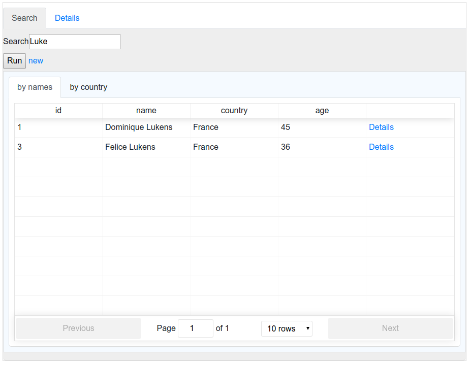

# Trucos

### WIP!

-------------------------------
`npm install trucos --save-dev`

index.js
```js
const trucos = require('trucos');

const resolvers = {
  sayHi: (params) => {
    return { greeting: `Hi ${params.who}!`};
  },
};

const tools = [
  {
    "endpoint": "say-hi",
    "label": "Say hi",
    "fields": [
      {
        "type": "string",
        "name": "who",
        "label": "Who?"
      }
    ],
    "queries": [
      {
        "label": "Greeting",
        "resolver": "sayHi",
        "params": ["who"],
        "display": "json",
      },
    ]
  }
];

trucos.run({
  port: 6006,
  tools: tools,
  resolvers: resolvers,
});
```

`node index.js`

**Screenshot**


